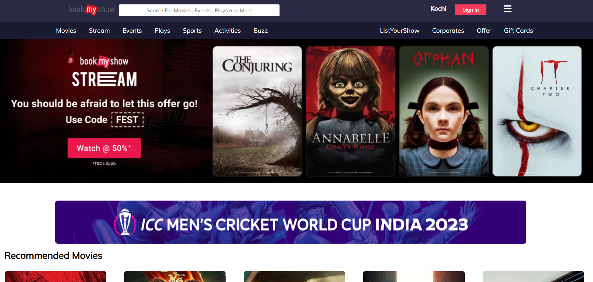

# 🎬 BOOKMYSHOW CLONE
### *My First Step into Web Development*

**A static frontend replica of the BookMyShow homepage, built to practice semantic HTML and CSS layouts.**

---

## 📖 Project Overview
This was my introductory project into the world of web development. The goal was to recreate the visual layout of a popular entertainment platform using purely **HTML** and **CSS**. It focuses on:
* Structuring content with semantic HTML tags.
* Styling elements and managing layouts with CSS.
* Implementing a clean, user-friendly interface.

---

## 📸 Preview

  

*Note: Since this is a static project, buttons and links are for visual representation only.*

---

## ✨ Features
* **Navigation Bar:** Replicated the original header with search and category links.
* **Banner Sliders:** Static representation of featured movie banners.
* **Image Assets:** Organized management of movie posters and icons.
* **Responsive Layout:** Basic styling to ensure the page structure remains intact.

---

## 🛠️ Tools Used
* **Markup:** HTML5
* **Styling:** CSS3 (External stylesheet)
* **Editor:** VS Code

---

## 🚦 How to Run
Since this is a static site, no installation is required:
1. Clone the repository.
2. Open `index.html` in any modern web browser.

---

## 📧 Contact
- **Developer:** [Faizal](https://github.com/faizal08)
- **Email:** [reachfaizal08@gmail.com](mailto:reachfaizal08@gmail.com)
